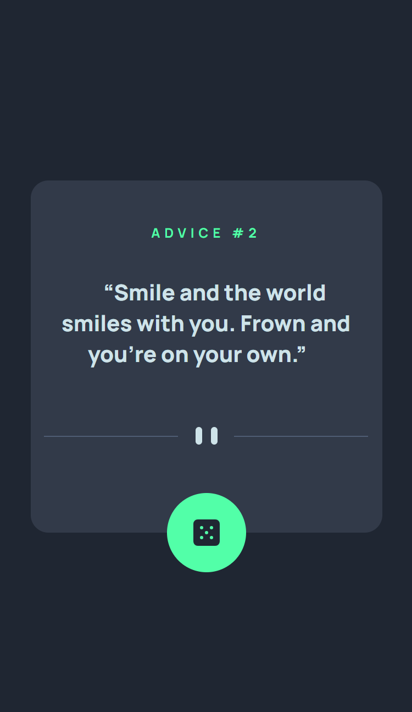
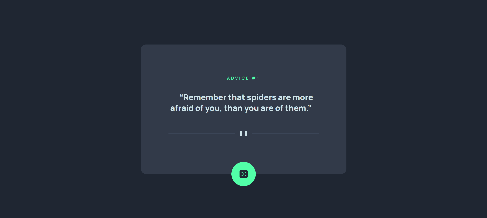

# Frontend Mentor - Advice generator app solution

This is a solution to the [Advice generator app challenge on Frontend Mentor](https://www.frontendmentor.io/challenges/advice-generator-app-QdUG-13db). 

## Table of contents

- [Overview](#overview)
  - [The challenge](#the-challenge)
  - [Screenshot](#screenshot)
  - [Links](#links)
- [My process](#my-process)
  - [Built with](#built-with)
  - [What I learned](#what-i-learned)
- [Author](#author)

## Overview

### The challenge

Users should be able to:

- View the optimal layout for the app depending on their device's screen size
- See hover states for all interactive elements on the page
- Generate a new piece of advice by clicking the dice icon

### Screenshot





### Links

- Solution URL: [Solution](https://github.com/radeau/advice-generate-app)
- Live Site URL: [Live](https://radeau.github.io/advice-generate-app)

## My process
My development process for this Advice Generator app involved utilizing Git for version control and hosting the project on GitHub. To build the core functionality and user interface, I leveraged npm for package management. The front-end itself was constructed with a combination of HTML for structure, CSS for styling, and JavaScript for interactivity. To achieve a responsive design that adapts to various screen sizes, I incorporated Tailwind CSS, a utility-first framework. The focus was on meticulously recreating the provided design, ensuring optimal layout across devices. This included implementing hover states for all interactive elements, like the dice button used to generate new advice, to enhance user experience.

### Built with

- Git/Github, NPM, TailwindCSS, HTML/CSS/JS

### What I learned

I learned how to interpret API documentation and write code to fetch data. This involved using the `fetch` API to retrieve advice from the "Advice Slip" API ([https://api.adviceslip.com/](https://api.adviceslip.com/)). Here's a snippet of the code that fetches and displays the advice:

```JS
function generateQuote() {
  fetch("https://api.adviceslip.com/advice")
    .then(response => response.json())  // Parsing the JSON
    .then(data => {
      const idNumber = data.slip.id;
      const quote = data.slip.advice;
      document.getElementById("idNumber").innerHTML = `ADVICE #${idNumber}`;
      document.getElementById("quoteText").innerHTML = `${quote}`;
    })
    .catch(error => {
      // display an error message
    });
}
```
And I also explored responsive design using Tailwind CSS. Tailwind's utility classes allowed me to easily control the layout of elements across different screen sizes. I even delved into customizing Tailwind's configuration file (`tailwind.config.js`) to tailor the framework to my specific needs. This could involve adjusting font sizes, colors, or spacing for a more personalized look and feel.

## Author

- Website - [radeau](https://www.github.com/radeau)
- Frontend Mentor - [@radeau](https://www.frontendmentor.io/profile/radeau)
